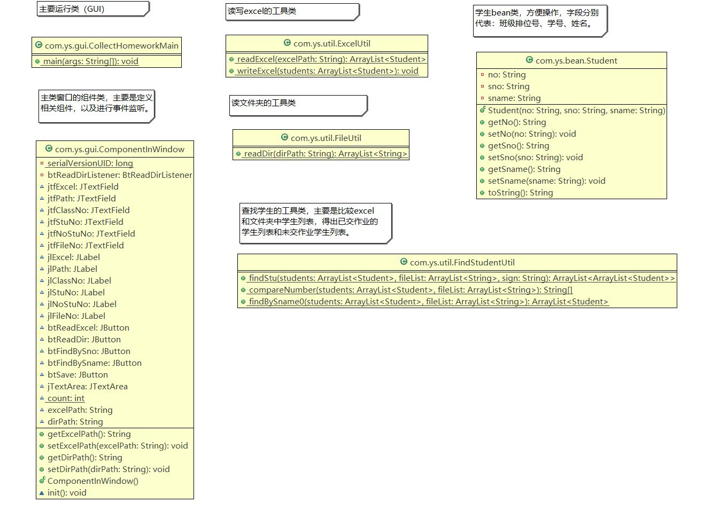

CollectHomework
================

  

出发点：为了方便学习委员收作业，自动清算已交作业的学生名单和未交作业的学生名单。

---

Table of Contents
=================

* [实现功能](#%E5%AE%9E%E7%8E%B0%E5%8A%9F%E8%83%BD)
* [主要类图](#%E4%B8%BB%E8%A6%81%E7%B1%BB%E5%9B%BE)
* [局限性](#%E5%B1%80%E9%99%90%E6%80%A7)
* [运行环境要求](#%E8%BF%90%E8%A1%8C%E7%8E%AF%E5%A2%83%E8%A6%81%E6%B1%82)
* [如何使用](#%E5%A6%82%E4%BD%95%E4%BD%BF%E7%94%A8)
* [注意事项](#%E6%B3%A8%E6%84%8F%E4%BA%8B%E9%A1%B9)

---

## 实现功能
1. 输入（班级）点名册路径（绝对路径，包含盘符、扩展名，eg: G:\\Workspaces\\班级点名册.xls），读取表格中的数据，获得学生列表。（对于一些有特殊情况的同学，即有备注的，则不加入学生列表中。）
2. 输入（存放学生作业的）文件夹路径（绝对路径），读取该目录下的所有文件，获得文件列表。
3. 按照学号或者是姓名，将1和2中的数据（即学生列表和文件列表）进行对比，可得到已交作业学生名单和未交作业的学生名单。
4. 提供接口，实现将3中的名单写到excel中。

## 主要类图

## 局限性
1. 因为这里读写Excel用的是jxl 包，该包只能读写以“.xls”为后缀的表格文件。

2. Excel内容需按照要求填写，不然无法正确读写（读取时，如果序号不为空，则认为该行有数据）：

<table align="center" style="text-align:center>
    <tr>
                             <th colspan="4"><b>班级名称，如：16计算机科学与技术1班</b></th>
    </tr>      
    <tr>
    	 <th>序号</th><th>学号</th><th>姓名</th><th>备注</th>
    </tr>
    <tr>
    	<td>1</td><td>20160310100</td><td>张三</td><td></td>
    </tr>
    <tr>
    	<td>2</td><td>20160310101</td><td>李四</td><td></td>
    </tr>
    <tr>
    	<td>……</td><td>……</td><td>……</td><td></td>
    </tr>
    <tr>
    	<td>10</td><td>20160310110</td><td>王五</td><td>休学</td>
    </tr>
    <tr>
    	<td>11</td><td>20160310111</td><td>王麻子</td><td>留级</td>
    </tr>
    <tr>
    	<td>12</td><td>20160310112</td><td>小六子</td><td>退学</td>
    </tr>
    <tr>
    	<td>……</td><td>……</td><td>……</td><td></td>
    </tr>
</table>

3. 备注内容只能是：休学、留级、退学。（如有差异，可以更改com.ys.util.ExcelUtil类中的第56行代码：

   `String[] signs = { "留级", "退学", "休学" };`）

4. 文件夹路径下的每个学生交的作业命名有一定要求，参考：***学号+姓名+作业名***，eg:***20160310100yansheng-java作业***。

## 运行环境要求

1. jdk1.8+
2. eclipse 4.0+  

## 如何使用

1. git clone <https://github.com/yansheng836/CollectHomework.git> 或者到该网址下载zip包。
2. 将项目导入到eclipse中。
3. 运行src/main/java下的com.ys.gui的CollectHomeworkMain类（或者com.ys.main的Main类），默认使用项目里面的测试数据（即点名册为："./测试用班级点名册.xls"，文件夹为："./测试用文件夹--已收作业"）；如需修改可以在对应位置进行修改，也可在GUI的文本框中输入对应路径。

## 注意事项

1. 因为该项目引用了外部jar包——jxl包，导入项目时，可能会出现jar包不存在对应错误（项目中会出现红叉）。

   解决方案：点击项目-->右键Build Path-->Configure Build Path-->Libraries-->移除报错的jar包，导入项目文件夹下的jxl.jar（jxl-2.6.12-sources.jar为jar包源码，不导也无所谓，有兴趣可以研究）-->Apply-->Apply and close，至此应该可以解决该问题。